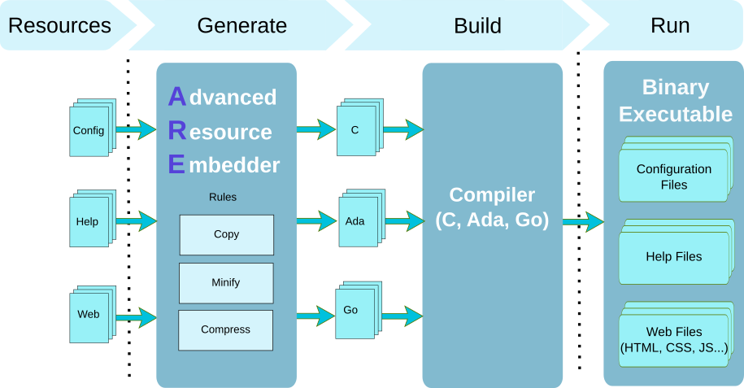

# Introduction

Incorporating files in a binary program can sometimes be a challenge.
The `Advance Resource Embedder` is a flexible tool that collects files such as
documentation, images, scripts, configuration files and generates a source
code that contains these files.  It is able to apply some
transformations on the collected files:

* it can run a Javascript minifier such as `closure`,
* it can compress CSS files by running `yui-compressor`,
* it can compress files by running `gzip` or another compression tool.

Once these transformations are executed, it invokes a target generator
to produce a source file either in C, Ada or Go language.  The generated
source file can then be used in the final program and taken into account
during the compilation process of that program.  At the end, the binary
will contain the embedded files with their optional transformations.

The process to use ARE is simple:

* You describe the resources that you want to embed.
  The description is either made on command line arguments or by writing an XML file.
  The XML description gives more flexibility as it allows to define a transformation rule that
  must be executed on the original file before being embedded.  This allows to minify a Javascript
  or CSS file, compress some files and even encrypt a file before its integration.
* You run the ARE command with your target language and rule description and you give the tool
  a list of directories that must be scanned to identify the files that must be collected.
  The ARE tool scan the directories according to the patterns that you have given either on
  the command line or in the XML rule description.  After identifying the files, the tool applies
  the rules and execute the transformations.
  The ARE tool then invokes the target language generator that writes one or several files depending
  on the list of resources.
* Once the files are generated, you use them in your program and add them in your build process
  as they are now part of your sources.  After building your program, it now embeds the
  resource files that were collected and optionally transformed.

This document describes how to build the tool and how you can use
the different features to embed files in a binary program witten in Ada, C/C++ or Go.

